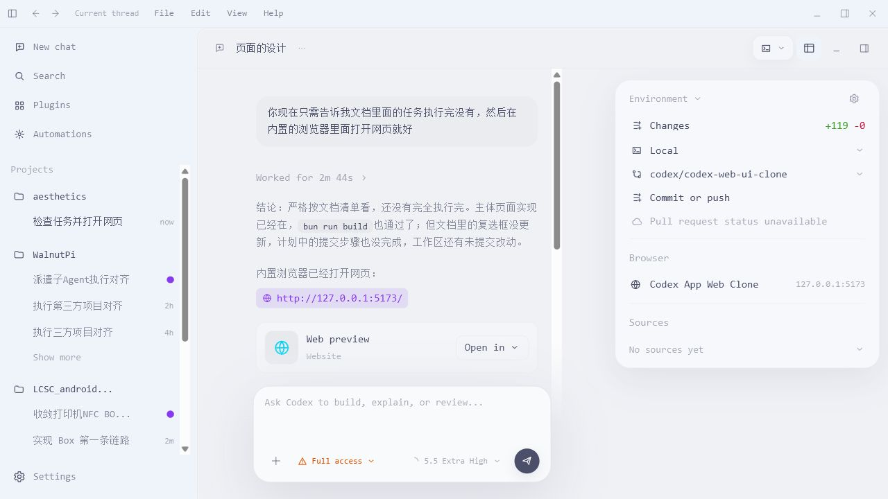

# Codex Web UI Clone

A Vite + React + TypeScript prototype that recreates the Codex desktop app workspace as a web UI. The current version is a static, screenshot-backed clone focused on layout fidelity, responsive tool surfaces, and the main Codex workbench states.

## Preview



## What It Includes

- Codex-style app shell with top menu, sidebar, project groups, and thread list.
- Main chat workspace with mocked conversation, tool output, composer, and running state.
- Responsive tool surfaces for tool switching, review diff, file browsing, terminal, and browser placeholders.
- Environment panel, settings view, and command palette.
- Custom local icon set and design tokens tuned to the reference screenshots in `docs/references/codex-app-screenshots`.

## Tech Stack

- React
- TypeScript
- Vite
- Tailwind CSS v4
- Bun

## Run Locally

Install dependencies:

```bash
bun install
```

Start the dev server:

```bash
bun run dev
```

Build for production:

```bash
bun run build
```

Preview the production build:

```bash
bun run preview
```

## Project Structure

```text
src/
  App.tsx
  components/
  data/
  styles/
  types.ts
docs/
  references/codex-app-screenshots/
  superpowers/specs/
  superpowers/plans/
```

## Current Status

This is a visual and interaction prototype. Most data is mocked in `src/data/mockData.ts`, and tool surfaces are intended to demonstrate the Codex workspace behavior rather than execute real terminal, browser, review, or file operations.
