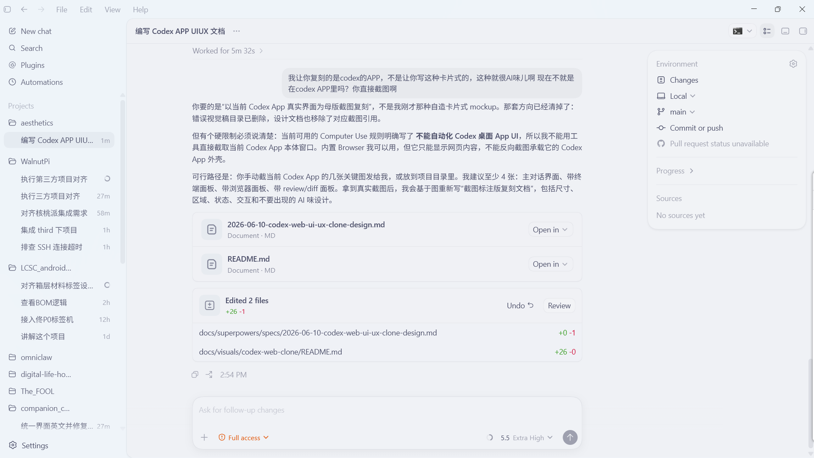
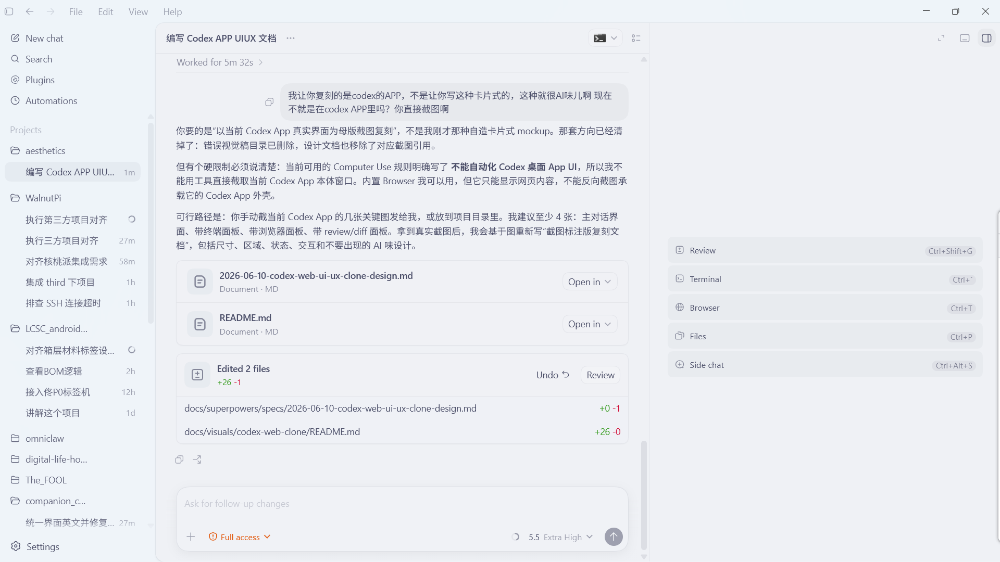
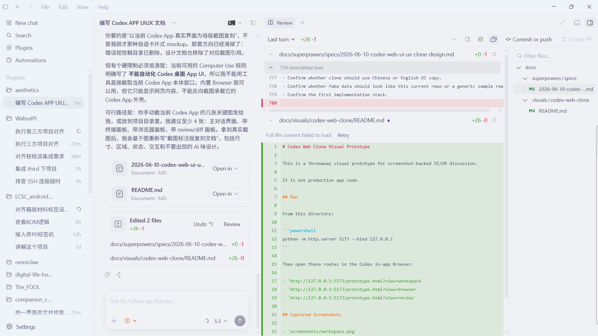
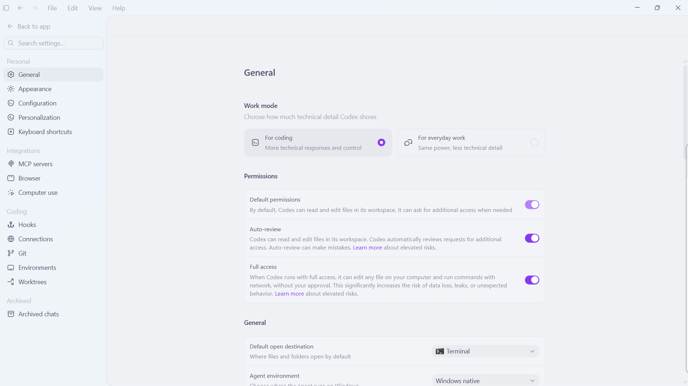
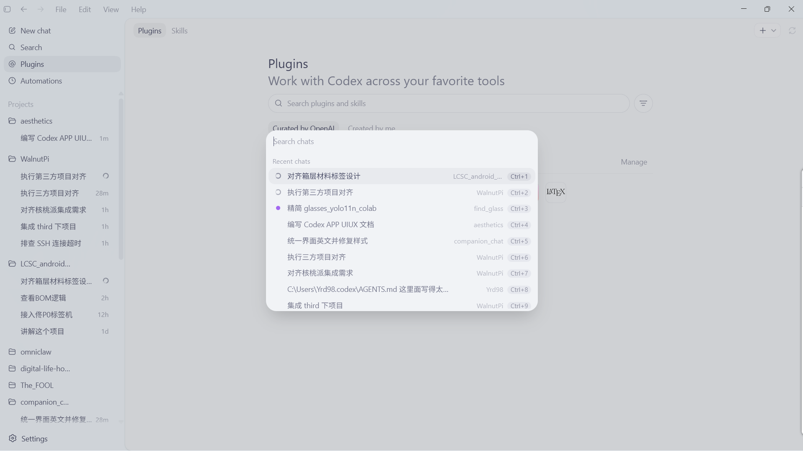
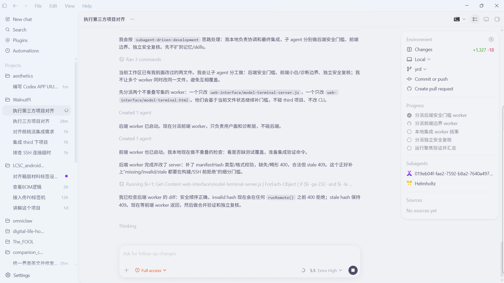
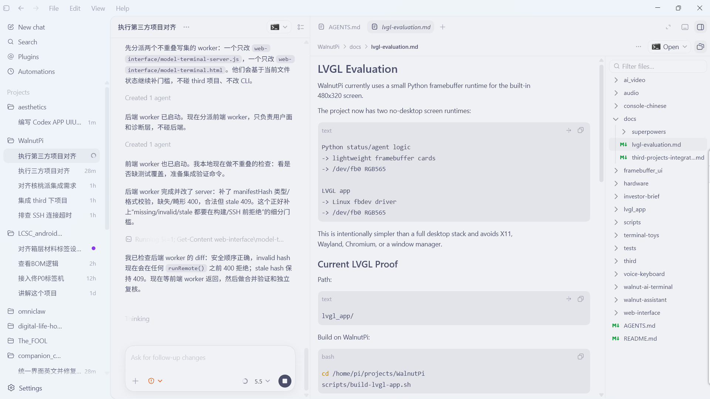

# Codex App UI/UX Web Clone Spec

Date: 2026-06-10
Status: Approved design for first runnable prototype
Target: Web implementation that visually and behaviorally recreates the Codex App workspace

## 1. Source Of Truth

This document uses real Codex App screenshots supplied by the user as the visual source of truth. Do not use generated dashboard mockups, card-heavy AI workspace patterns, marketing layouts, or invented visual language.

Reference screenshots:

- [01-main-chat-environment.png](../../references/codex-app-screenshots/01-main-chat-environment.png)
- [02-tool-switcher-overlay.png](../../references/codex-app-screenshots/02-tool-switcher-overlay.png)
- [03-review-diff-panel.png](../../references/codex-app-screenshots/03-review-diff-panel.png)
- [04-settings-general.png](../../references/codex-app-screenshots/04-settings-general.png)
- [05-command-palette.png](../../references/codex-app-screenshots/05-command-palette.png)
- [06-running-progress-subagents.png](../../references/codex-app-screenshots/06-running-progress-subagents.png)
- [07-file-viewer-sidebar.png](../../references/codex-app-screenshots/07-file-viewer-sidebar.png)

The screenshots show a Windows Codex App shell. The Web clone should recreate the app surface, not merely borrow the idea of a coding assistant.

Local configuration is also a source of truth for this user's Codex instance:

- Config file: `C:\Users\Yrd98\.codex\config.toml`
- `desktop.appearanceTheme = "light"`
- `desktop.appearanceLightCodeThemeId = "catppuccin"`
- `desktop.appearanceDarkCodeThemeId = "catppuccin"`
- Light chrome theme: `surface = "#eff1f5"`, `ink = "#4c4f69"`, `accent = "#8839ef"`, `contrast = 45`, `opaqueWindows = false`
- Light semantic colors: `diffAdded = "#40a02b"`, `diffRemoved = "#d20f39"`, `skill = "#8839ef"`
- Light fonts: UI and code both use `JetBrainsMono Nerd Font Mono`
- Dark chrome theme exists but is not the active target: `surface = "#1e1e2e"`, `ink = "#cdd6f4"`, `accent = "#cba6f7"`, `contrast = 60`

The first Web clone should default to the active local light theme. Screenshot sampling is used only to calibrate derived surfaces, borders, hover fills, shadows, and overlay dimming.

## 1.1 Confirmed Prototype Direction

The first implementation should be a runnable static-data prototype, not another design-only artifact.

Confirmed stack:

- Vite.
- React.
- TypeScript.
- Tailwind CSS v4.
- Tailwind's Vite plugin: `tailwindcss` plus `@tailwindcss/vite`.
- No component library in the first pass.
- No shadcn/ui, Radix Themes, dashboard kit, or marketing template.

Styling model:

- Use Tailwind utilities for layout, spacing, responsive behavior, state styling, and common component structure.
- Keep Codex theme values in editable CSS variables under `src/styles/tokens.css`.
- Use Tailwind arbitrary values where the clone needs screenshot-like dimensions, such as `w-[298px]`, `rounded-[24px]`, or custom shadows.
- Keep a small amount of plain CSS for global tokens, container behavior, text rendering, and browser reset only.

Prototype constraints:

- Static data is acceptable and preferred for the first pass.
- Interactions should switch visible states and panels, but do not need persistence or real Codex backend behavior.
- Visual fidelity matters more than abstract component reuse.
- The page should open directly into the app workbench, not a landing page.

## 2. Design Read

This is a quiet native-app workbench:

- Pale blue-gray application chrome.
- Very low contrast separators.
- Dense but calm navigation.
- Wide reading surfaces.
- Floating panels and drawers with soft shadows.
- Minimal accent color usage.
- Text-first hierarchy.
- Icons as functional labels, not decoration.

The design should feel closer to a native desktop productivity app than a SaaS dashboard.

Avoid:

- Card-grid dashboards.
- Bento layouts.
- Large rounded marketing cards.
- Purple/blue gradient AI branding.
- Hero sections.
- Oversized empty states.
- Decorative blobs, glows, illustrations, or fake screenshots.
- Loud shadows.
- Centered product copy.
- Chat bubbles as the dominant visual language.

## 3. Screenshot Notes

### 3.1 Main Chat + Environment Panel



Observed structure:

- Full app frame includes a top native menu row: small sidebar icon, back/forward arrows, `File`, `Edit`, `View`, `Help`, then Windows controls.
- Left navigation is fixed at about 298 px wide.
- Main app content begins after the left sidebar and has a rounded top-left container edge.
- The active chat title sits in a 58-60 px top bar.
- Conversation content is centered with a readable column around 920 px.
- Right side uses a floating environment card, not a full-height heavy panel.
- Bottom composer is a large floating rounded rectangle with a soft upward fade behind it.

Important details to replicate:

- Sidebar background is slightly bluer than the main canvas.
- Active nav item uses a soft gray-blue fill, not a bright accent.
- Conversation text is not boxed except the user's message and artifact/change summaries.
- Artifact summaries are list blocks with thin separators and soft icon wells.
- The environment panel has a 20-24 px radius, subtle border, and soft shadow.
- Composer controls live inside the same rounded input surface.

### 3.2 Tool Switcher Overlay



Observed structure:

- The main chat column narrows when the right-side tool area opens.
- Tool selection appears as a floating list on the right canvas, vertically centered.
- Rows are wide, flat, and separated by small gaps.
- Active/hover row uses a barely darker fill.
- Shortcut badges are tiny rounded capsules aligned right.

Important details to replicate:

- Tool switcher is not a modal dialog.
- It is not a card grid.
- Background remains visible.
- It should feel like an app command surface attached to the right workspace.

### 3.3 Review / Diff Panel



Observed structure:

- Review is a split workspace: chat remains on the left, review content on the right.
- A tab strip appears at the top of the tool workspace.
- Review toolbar contains compact actions: last turn, diff stats, overflow, file tools, commit/push, create PR.
- Diff content uses a very pale code background and thin row separators.
- File tree lives in a narrow right drawer.
- Removed lines are pale red; added sections are pale green.

Important details to replicate:

- Review panel is not a generic code editor clone.
- It preserves the Codex App shell and chat context.
- The file tree is subordinate to the diff, not the primary surface.
- Buttons use soft gray fills and small radii.
- Disabled actions are visibly muted.

### 3.4 Settings



Observed structure:

- Settings keep the same left shell width but replace project nav with settings nav.
- Main settings content is centered, not full width.
- Page title sits around x=680 and y=190 in a 1920 px screenshot.
- Settings groups are simple list panels with light borders.
- Work mode choices are horizontal option rows, not large cards.
- Toggles use a vivid purple accent, but only for switch state.

Important details to replicate:

- Settings page has large blank canvas areas.
- Section titles are compact and medium weight.
- Descriptions use muted gray-blue text.
- Controls are aligned precisely to the right edge of their row.
- Purple is allowed for toggles only, not as the app brand color.

### 3.5 Command Palette / Chat Search



Observed structure:

- Background is dimmed with a translucent gray overlay.
- Palette is centered, about 650 px wide, with 24 px radius.
- Search input is visually integrated into the panel, not boxed heavily.
- Recent chat rows are flat.
- Active row has a muted gray highlight.
- Project names and shortcut pills align right.

Important details to replicate:

- Overlay shadow is soft and broad.
- Palette content density is high.
- Shortcuts are small gray pills.
- The selected row uses a very subtle fill and a tiny status marker.

### 3.6 Running Progress + Subagents



Observed structure:

- Chat body is mostly prose and inline tool state, not message cards.
- Inline code tokens use soft gray rounded capsules.
- Running command rows are extremely quiet and low contrast.
- Right environment panel shows progress checklist, subagents, sources.
- The stop button replaces send in the composer while running.
- The right environment card shows active change stats in green/red.

Important details to replicate:

- Progress checklist uses small circular status icons.
- Subagent entries include colored glyphs, not large avatars.
- Thinking state is plain muted text.
- Composer stays fixed/floating even while task runs.

### 3.7 File Viewer + File Tree



Observed structure:

- File viewer opens as a right workspace beside the chat.
- Tool tabs support multiple open documents.
- Active tab has a soft filled rounded background.
- File content area is wide, readable, and uses document typography.
- Code blocks are wide gray panels with copy icons.
- File tree is a narrow right drawer with search at the top.

Important details to replicate:

- Document viewer is not a browser page and not an IDE.
- Breadcrumb row is compact and muted.
- H1 document headings are large but still restrained.
- Right file tree selection uses pale fill and small Git status marks.

## 4. Layout Model

### 4.1 App Frame

The Web clone should mimic a desktop app frame even though it runs in the browser.

Frame regions:

```text
+--------------------------------------------------------------------------------+
| native-like menu row: app icon, back/forward, File, Edit, View, Help, controls  |
+---------------+----------------------------------------------------------------+
| left sidebar  | main shell with rounded top-left app container                  |
| project nav   | chat / tools / settings depending on route                       |
+---------------+----------------------------------------------------------------+
```

Target dimensions at 1920 x 1080:

- Top menu row: 40-44 px.
- Left sidebar: 296-300 px.
- Main shell starts at x=297.
- Header bar inside main shell: 58-60 px.
- Main content right padding: 18-22 px.
- Chat readable column: about 920 px.
- Floating environment card: about 374 px wide.
- Composer: about 920 px wide, 124 px tall.

### 4.2 Left Sidebar

Sidebar sections:

- Primary actions: New chat, Search, Plugins, Automations.
- Project label.
- Project groups.
- Active thread rows.
- Settings pinned to bottom.

Style:

- Background: pale blue gray.
- Text: gray-blue, medium contrast.
- Icons: 18-20 px outline.
- Row height: 38-40 px for primary nav, 36-38 px for thread rows.
- Active row: soft fill, radius about 10 px.
- Project names use folder icons.
- Thread titles truncate with ellipsis.
- Activity times align right.
- Running indicator is a small circular spinner/dot at row right.

Do not:

- Add colorful project icons.
- Add large avatars.
- Make the sidebar dark.
- Use nested card containers.

### 4.3 Chat Workspace

The chat column should read like a document stream:

- Assistant output is plain text with generous line height.
- User prompt appears in a small rounded bubble aligned to the right-ish center.
- System/tool states are inline rows, not full cards.
- Artifact summaries and edited-file summaries can use thin bordered blocks.
- Copy/pop-out controls appear as small muted icons near message groups.

Typography:

- Body text: 17-18 px in screenshots; Web clone can use 16-17 px depending on font rendering.
- Line height: 1.55-1.7.
- Muted labels: 14-15 px.
- Inline code: same size as body, gray capsule background.

### 4.4 Composer

Composer is one of the key visual anchors.

Observed:

- Fixed near bottom center.
- Large rounded rectangle, about 24 px radius.
- Background is very light with subtle border.
- Shadow is broad and faint.
- Placeholder is pale gray.
- Bottom control row contains plus, permission state, model/reasoning controls, and send/stop.
- Permission state can use orange/red accent.
- Send button is circular, gray-purple.

Implementation notes:

- Use a sticky/fixed composer inside main shell.
- Add bottom gradient/fade behind it.
- Keep controls inside the input surface.
- While running, replace send with stop.
- Do not use a separate toolbar card below the input.

### 4.5 Right Environment Card

The environment card is a floating panel, not a full-height sidebar in the default chat view.

Sections:

- Environment title and settings icon.
- Changes with green/red counts.
- Mode: Local / Worktree / Cloud.
- Branch.
- Commit or push.
- Pull request state/action.
- Progress checklist.
- Subagents.
- Sources.

Style:

- Width: about 374 px.
- Radius: 20-24 px.
- Border: very light.
- Shadow: soft, low opacity.
- Section separators: thin horizontal lines.
- Items: icon left, label center, optional value right.

In review/file modes, the right side becomes a full tool workspace. In default chat mode, keep the card floating.

## 5. Tool Workspaces

### 5.1 Tool Switcher

The tool switcher is a contextual overlay in the right workspace.

Rows:

- Review.
- Terminal.
- Browser.
- Files.
- Side chat.

Rules:

- Width around 600 px.
- Row height around 50-54 px.
- Each row has icon, label, shortcut badge.
- No dense card shadows.
- No marketing descriptions under each row.
- Overlay should appear without hiding the left sidebar or chat.

### 5.2 Review

Review is a split workspace with chat retained.

Layout:

- Left: chat column, narrower.
- Center/right: diff review workspace.
- Far right: file tree drawer.

Top controls:

- Tool tabs.
- Last turn selector.
- Diff stat.
- Compact icon buttons.
- Commit or push.
- Create PR disabled/enabled state.

Diff rules:

- Code font is monospace and small.
- Unmodified blocks can collapse into gray rows.
- Remove background is pale red.
- Add background is pale green.
- Gutter line numbers stay visible.
- File headers are collapsible rows.
- Use thin separators instead of card boxes.

### 5.3 File Viewer

File viewer shares the same right workspace framework as review.

Layout:

- Chat retained on left.
- Document viewer center.
- File tree right.

Viewer rules:

- Tabs at top support multiple open files.
- Breadcrumb below tabs.
- Document content has a max readable width but can use broad code blocks.
- Code blocks use soft gray background, 12-16 px radius, copy icon at top right.
- File tree search is compact and rounded.

### 5.4 Settings

Settings are not a modal.

Layout:

- Same app frame.
- Left settings navigation.
- Centered settings content.
- Wide blank right area.

Settings controls:

- Option rows for mode selection.
- List-panel rows for permissions.
- Right-aligned toggles.
- Dropdown rows for default open destination and agent environment.

Use purple only for active toggles/radio states.

### 5.5 Command Palette

Command palette / chat search is a true overlay.

Rules:

- Dim full app with translucent gray.
- Center palette with about 650 px width.
- Radius about 24 px.
- Search field is integrated.
- Recent rows are list rows.
- Active row is a pale fill.
- Shortcut badges align right.
- Background app stays visible and blurred/dimmed only slightly.

## 6. Responsive Layout Rules

Responsive behavior is central to the clone. The app should not be a desktop screenshot pasted into a browser; it should preserve Codex's workspace hierarchy as width changes.

### 6.1 Layout Invariants

These rules remain true at every width:

- The composer stays the primary input anchor.
- Chat remains prose-first and visible unless the user intentionally switches to a full-screen tool view.
- Tool workspaces attach to the thread, rather than replacing the whole app with an unrelated page.
- Sidebar navigation is dense and text-heavy; it never becomes a grid of cards.
- Environment/status information is secondary to the thread.

### 6.2 Desktop Wide: 1440 px And Up

Use the full Codex desktop composition:

- Native-like top menu row across the full window.
- Left sidebar fixed around 296-300 px unless user configuration says otherwise.
- Main shell starts after the sidebar with rounded top-left corner.
- Default chat: centered chat column plus floating environment card on the right.
- Review/files/browser/terminal: chat narrows and the tool workspace opens to the right.
- Right tool workspace can hold a far-right file tree or auxiliary drawer.

### 6.3 Desktop Standard: 1100-1439 px

Preserve the full shell but reduce secondary surfaces:

- Sidebar can shrink toward 240 px, matching the user's saved `sidebar-width` state.
- Environment card becomes narrower or docks as a collapsible right rail.
- Tool workspaces still open beside chat, but the chat column compresses first.
- Toolbar labels should collapse before icons disappear.

### 6.4 Tablet / Narrow Web: 768-1099 px

Switch from three-column to two-surface behavior:

- Sidebar collapses to an icon rail or drawer.
- Chat and tool workspace become a split pair only when there is enough space.
- Environment card opens as a right overlay drawer, not as a persistent card.
- File tree becomes an overlay inside the tool workspace.
- Command palette width becomes `min(650px, calc(100vw - 32px))`.

### 6.5 Mobile / Very Narrow: Under 768 px

Use one primary surface at a time:

- Sidebar is hidden behind a menu button.
- Chat, Review, Files, Terminal, Browser, and Settings are route-level panels.
- Composer remains fixed at the bottom of the active thread view.
- Environment/status opens as a bottom sheet or full-height drawer.
- Tool switcher becomes a compact command list, still not a card grid.
- All toolbar icon buttons keep stable 36-40 px hit targets.

### 6.6 Container Queries

The extracted Codex CSS uses container-query-style shell behavior, including `container: app-shell-main-content / inline-size` and a `96rem` threshold for edge-scroll behavior. The Web clone should use container queries for shell decisions where possible, so embedded panes and full-window layouts adapt consistently.

## 7. Visual Tokens

These values start from the user's local Codex configuration and are then expanded into practical UI tokens.

Colors:

```css
:root {
  /* Local Codex light chrome theme */
  --codex-surface-root: #eff1f5;
  --codex-ink: #4c4f69;
  --codex-accent: #8839ef;
  --codex-skill: #8839ef;
  --codex-diff-added: #40a02b;
  --codex-diff-removed: #d20f39;

  /* Derived from screenshots and Codex token behavior */
  --codex-window: #eef4f9;
  --codex-sidebar: #e4eaf0;
  --codex-main: #eff1f5;
  --codex-surface: #f1f3f6;
  --codex-surface-raised: #f8fafc;
  --codex-surface-muted: #e7e9ed;
  --codex-active: #eef4f9;
  --codex-hover: color-mix(in oklab, var(--codex-ink) 7%, transparent);
  --codex-border: color-mix(in oklab, var(--codex-ink) 12%, transparent);
  --codex-border-soft: color-mix(in oklab, var(--codex-ink) 6%, transparent);
  --codex-text: #4c4f69;
  --codex-text-muted: color-mix(in oklab, var(--codex-ink) 65%, transparent);
  --codex-text-faint: color-mix(in oklab, var(--codex-ink) 45%, transparent);
  --codex-permission: #e25507;
  --codex-overlay-dim: rgb(76 79 105 / 28%);
}
```

Dark-mode tokens should exist because the local config includes a dark theme, but the first clone target is the active light theme.

```css
:root[data-theme="dark"] {
  --codex-surface-root: #1e1e2e;
  --codex-ink: #cdd6f4;
  --codex-accent: #cba6f7;
  --codex-skill: #cba6f7;
  --codex-diff-added: #a6e3a1;
  --codex-diff-removed: #f38ba8;
}
```

Radii:

- Main shell: 16-18 px top-left.
- Sidebar active row: 10-12 px.
- Composer: 22-26 px.
- Environment card: 20-24 px.
- Palette: 24 px.
- Small buttons: 10-12 px.
- Inline code capsules: 6-8 px.

Borders and shadows:

- Borders should be visible only as soft structure.
- Avoid black shadows.
- Use blue-gray shadow tints.
- Most panels should rely on contrast and border, not elevation.

Typography:

- Use the local configured font first: `JetBrainsMono Nerd Font Mono`.
- Apply it to both UI and code by default, matching `desktop.appearanceLightChromeTheme.fonts`.
- Keep a fallback stack: `ui-monospace, "SFMono-Regular", "SF Mono", Menlo, Consolas, "Liberation Mono", monospace`.
- The extracted Codex CSS uses `--text-base: 14px`, `--text-lg: 16px`, and `--font-weight-medium: 500`; do not make this feel like a 16 px SaaS dashboard.
- Keep text color gray-blue from `ink`, not pure black.
- Headings are medium weight, compact, and app-native.

## 8. Icon System

The Codex App bundle contains many local icon modules, such as `settings.cog`, `search`, `plus`, `arrow-up`, `folder`, `terminal`, `history`, `file-diff`, `three-dots`, `x`, `check-circle`, and `cloud`.

Observed icon traits:

- SVGs are usually 20 x 20 or 21 x 21.
- Paths use `fill="currentColor"`, not stroke-only outlines.
- Many glyphs look like outline icons, but the outline is encoded as filled compound paths.
- Icons inherit muted text colors and only use accent colors for state.
- Buttons place icons in stable square hit areas around 32-40 px.

Implementation rule:

- Build a local `CodexIcon` registry for the clone instead of mixing random icon families.
- Start by recreating the needed glyph names from the bundle shape: new chat, search, plugins, automations, settings, review, terminal, browser, files, side chat, plus, send, stop, branch, cloud/local, diff, folder, history, overflow, check, warning, x.
- If a library fallback is needed, use one family only and normalize every glyph to 20 px, `currentColor`, filled-path or visually equivalent 1.5 px outline weight.
- Do not use large illustrative icons, colored app icons, emoji, or mixed icon styles.

## 9. Implementation Requirements

First pass should implement these screens:

1. Main chat with environment card.
2. Tool switcher overlay.
3. Review/diff workspace.
4. File viewer workspace.
5. Settings general page.
6. Command palette / search overlay.
7. Running progress state with subagents.

Use static data first. The goal is visual and interaction fidelity.

### 9.1 App State Model

The prototype should use a single-page React state model.

Core state:

- `activeView`: `chat`, `tool-switcher`, `review`, `files`, `settings`, `terminal`, `browser`, or `running`.
- `activeThreadId`: selected thread row in the sidebar.
- `activeFileTab`: selected file tab in the file viewer.
- `isCommandPaletteOpen`: whether the search overlay is visible.
- `isEnvironmentOpen`: whether the environment panel or mobile drawer is visible.

The first pass does not need URL routing. Buttons should visibly change the workspace state so the prototype can be reviewed in the browser.

### 9.2 Component Structure

Use a small, explicit component tree:

- `App`: owns top-level static data and workspace state.
- `AppFrame`: renders the native-like top row, sidebar, main shell, overlays, and responsive shell layout.
- `TopMenu`: simulates the Windows Codex menu row and window controls.
- `Sidebar`: renders primary actions, project groups, thread rows, and settings entry.
- `ChatWorkspace`: composes the chat header, chat stream, composer, environment card, and optional tool workspace.
- `ChatStream`: prose-first conversation content and inline tool/result rows.
- `Composer`: floating input surface with internal controls and send/stop state.
- `EnvironmentCard`: floating environment, changes, progress, subagents, and sources panel.
- `ToolSwitcher`: contextual right-workspace command list.
- `ReviewWorkspace`: tool tabs, compact toolbar, diff surface, and file tree drawer.
- `FileWorkspace`: tool tabs, breadcrumb, document viewer, code blocks, and file tree drawer.
- `SettingsView`: settings navigation and centered settings list panels.
- `CommandPalette`: dimmed overlay with integrated search and recent chat rows.
- `CodexIcon`: local icon registry with a single visual style.

Keep components direct and domain-named. Do not create a generic dashboard-card system.

### 9.3 Tailwind Usage Rules

Tailwind is the primary styling tool for the prototype, but it should not erase the Codex-specific visual language.

- Prefer token-backed arbitrary colors such as `bg-[var(--codex-sidebar)]` and `text-[var(--codex-text)]`.
- Use fixed screenshot-calibrated dimensions where the app shell depends on them.
- Use responsive prefixes and container queries to preserve the hierarchy at desktop, tablet, and mobile widths.
- Keep purple accent usage limited to active switches, skill/state indicators, and send/stop affordances.
- Avoid default Tailwind palette drift such as random blue, slate, zinc, or violet utilities outside the token layer.
- Avoid generic `shadow-lg`, `rounded-3xl`, and card defaults when a calibrated custom value is needed.

### 9.4 First-Pass Verification

Before considering the prototype complete:

- Install dependencies with `bun`, unless it is unavailable on the machine.
- Run the project build.
- Start the local dev server.
- Open the app in the browser.
- Verify the seven target states: main chat, tool switcher, review, file viewer, settings, command palette, and running progress.
- Check that the first viewport is the usable app workbench, not explanatory copy.

Minimum interactions:

- Select project/thread in sidebar.
- Toggle tool switcher.
- Open Review, Files, Terminal, Browser as tool workspaces.
- Open settings.
- Open command palette.
- Switch between file tabs.
- Show running/stop composer state.
- Show environment progress checklist.

## 10. Fidelity Checklist

The clone fails review if any of these appear:

- Card-based dashboard layout.
- Marketing hero.
- Bento grid.
- Purple AI gradient.
- Oversized round cards.
- Large illustrative icons.
- ChatGPT-style centered assistant landing page.
- Dark terminal aesthetic as primary shell.
- Heavy border boxes around every message.
- Random accent colors.
- Generic "AI workspace" visual language.

The clone passes the first visual review when:

- A screenshot of the Web clone is immediately recognizable as Codex App-inspired.
- The left sidebar matches Codex's density and pale blue-gray tone.
- The main chat reads as prose-first, not card-first.
- The composer closely matches the floating Codex composer.
- The environment card floats with the right radius, shadow, sections, and spacing.
- Review and file workspaces preserve the left chat context.
- Settings and command palette match the real app's calm, low-contrast treatment.

## 11. Implementation Calibration Notes

1. Exact measurements should be calibrated in browser against the reference screenshots during implementation rather than relying only on this document's approximate pixel values.
2. Theme configurability should remain token-driven. The first prototype ships with this user's local light theme as the default preset and keeps colors/fonts editable through CSS variables.

## 12. Closed Decisions

1. UI copy language: use Chinese where the active conversation or user-facing sample content is Chinese, and English for app/system labels where that matches the screenshots.
2. Window chrome: keep an internal app frame that visually suggests the Codex desktop shell, because native Windows controls cannot be truly recreated in a normal browser tab.
3. Icon source: use an internal `CodexIcon` registry for the clone. Do not present approximated glyphs as a public Codex icon package.
4. Implementation stack: use Vite, React, TypeScript, and Tailwind CSS v4 with `@tailwindcss/vite`.
